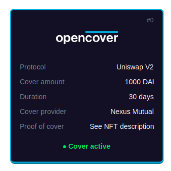

<h1>OpenCover Contracts &nbsp;&nbsp;</h1>

OpenCover's smart contracts to make Nexus Mutual covers accessible on L2s.

## Overview

Users interact with OpenCover by submitting a quote on any supported L2 chain for a specific cover product.
This quote is represented by a dynamic NFT that changes depending on the quote's status (active, refunded, etc.) – [see previews](data/nft-preview/) of the NFT throughout the quote's lifecycle.

Once a quote is submitted a settlement period starts which allows OpenCover to purchase the corresponding cover on L1. In case the quote is not settled within this period users have the option to refund the quote.

When a quote is settled the transaction hash of the L1 cover purchase is attached to the quote along with the cover's expiry date.

## Repository Structure

| Folder          | Purpose                                             |
|-----------------|-----------------------------------------------------|
| `contracts/`    | Solidity contracts and interfaces for OpenCover.    |
|  `interface/`   | Interfaces for the OpenCover contracts.             |

### Deployment

The OpenCover contracts are deployed on _Optimism_, _Base_, _Arbitrum_ and _Polygon_ mainnets.

The `Quote` contract deployed to L2 chains uses an UUPS proxy to allow for upgradability.

#### Optimism

| Contract             | Address                                                                                                                    |
|----------------------|----------------------------------------------------------------------------------------------------------------------------|
| Quote                | [`0x0AC34fe133BdE3A2eF589a18A4E10b6a7d253829`](https://optimistic.etherscan.io/address/0x0AC34fe133BdE3A2eF589a18A4E10b6a7d253829) |
| Quote Implementation | [`0x0F18789f6837f99B9B1F176eC1BF3a410fbae764`](https://optimistic.etherscan.io/address/0x0F18789f6837f99B9B1F176eC1BF3a410fbae764) |

#### Base

| Contract             | Address                                                                                                                    |
|----------------------|----------------------------------------------------------------------------------------------------------------------------|
| Quote                | [`0xD68647555e5da198d50866334EEd647cbE3d1556`](https://basescan.org/address/0xD68647555e5da198d50866334EEd647cbE3d1556) |
| Quote Implementation | [`0x0AC34fe133BdE3A2eF589a18A4E10b6a7d253829`](https://basescan.org/address/0x0AC34fe133BdE3A2eF589a18A4E10b6a7d253829) |

#### Arbitrum

| Contract             | Address                                                                                                                    |
|----------------------|----------------------------------------------------------------------------------------------------------------------------|
| Quote                | [`0x0AC34fe133BdE3A2eF589a18A4E10b6a7d253829`](https://arbiscan.io/address/0x0AC34fe133BdE3A2eF589a18A4E10b6a7d253829) |
| Quote Implementation | [`0x16326c241BC4043C9a08366F5C676ff34D9576d0`](https://arbiscan.io/address/0x16326c241BC4043C9a08366F5C676ff34D9576d0) |

#### Polygon

| Contract             | Address                                                                                                                    |
|----------------------|----------------------------------------------------------------------------------------------------------------------------|
| Quote                | [`0x0AC34fe133BdE3A2eF589a18A4E10b6a7d253829`](https://polygonscan.com/address/0x0AC34fe133BdE3A2eF589a18A4E10b6a7d253829) |
| Quote Implementation | [`0xAF49c6d8FCbD6183D9cc5527aCF70676902A4b67`](https://polygonscan.com/address/0xAF49c6d8FCbD6183D9cc5527aCF70676902A4b67) |
